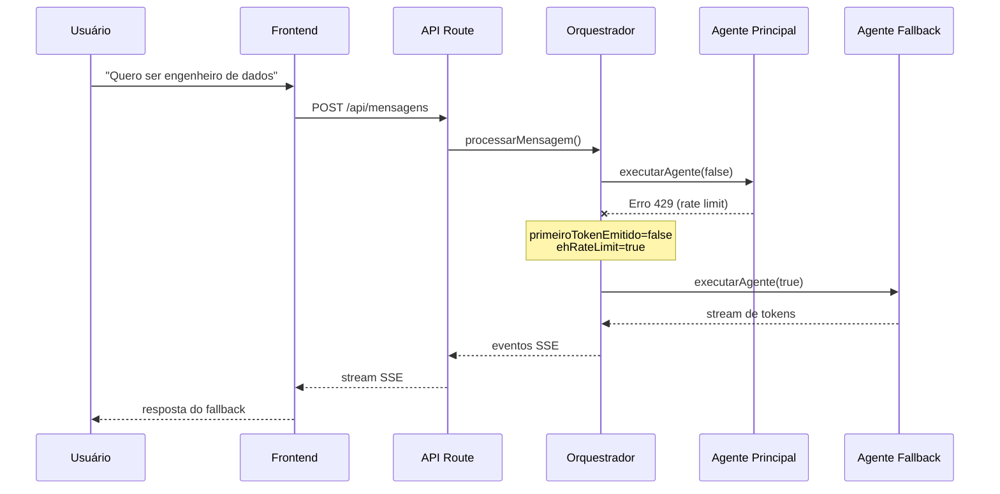

# Mecanismo de Fallback e Tolerância a Falhas

O NextStepAI implementa um mecanismo robusto de fallback para garantir que a conversa com o usuário não seja interrompida mesmo diante de falhas parciais (timeout, rate limit, erro em tool). O orquestrador (`src/agentes/orquestrador.ts`) é responsável por gerenciar essas situações.

## Visão Geral do Fallback

| Nível | Disparo | Ação |
|--------|----------|------|
| **Tool-level** | Timeout (>15s) na busca vetorial | Retorna JSON de fallback; agente usa conhecimento geral |
| **Agent-level (pré-stream)** | Erro ou timeout antes do 1º token | Tenta agente fallback (modelo menor) |
| **Agent-level (pós-stream)** | Erro após já ter emitido tokens | Interrompe stream com erro amigável, **sem tentar fallback** |

---

## 1. Tool-level Fallback (Busca Vetorial)

Implementado em:

`src/agentes/ferramentas/buscar-vetor.ts`

### Exemplo de implementação

```ts
const TIMEOUT_TOOL_MS = 15_000;

async function buscarComTimeout(query: string): Promise<string> {
  const timeoutPromise = new Promise<never>((_, rejeitar) =>
    setTimeout(
      () => rejeitar(new Error('Timeout de 15s')),
      TIMEOUT_TOOL_MS
    )
  );

  const buscaPromise = buscarVagasSimilares(
    query,
    TOP_K_VAGAS
  );

  return Promise.race([
    buscaPromise,
    timeoutPromise,
  ]);
}
```

Se a busca exceder **15 segundos**, a tool **não lança exceção** — ela retorna um JSON estruturado com `erro: true`.

### Exemplo de retorno de fallback

```json
{
  "erro": true,
  "tipoErro": "timeout",
  "mensagem": "A busca no banco de vagas demorou demais. Continue a resposta usando seu conhecimento geral."
}
```

O agente interpreta esse JSON e prossegue normalmente com base no conhecimento interno, evitando travar a conversa.

---

## 2. Agent-level Fallback (Orquestrador)

No arquivo:

`src/agentes/orquestrador.ts`

A função `processarMensagem()` controla o fallback do agente.

### Fluxo simplificado

```ts
let primeiroTokenEmitido = false;

try {
  for await (const evento of executarAgente(
    false,
    messages,
    usuarioId
  )) {
    if (evento.type === 'token') {
      primeiroTokenEmitido = true;
    }

    yield evento;
  }
} catch (error) {
  if (primeiroTokenEmitido) {
    // Já enviou parte da resposta
    yield {
      type: 'error',
      message:
        'A resposta foi interrompida. Tente novamente.',
    };

    return;
  }

  // Ainda não emitiu tokens
  // → tenta fallback
}
```

### Quando o fallback é ativado

O fallback do agente é acionado quando ocorre:

- **Rate limit** (`429`) do provedor LLM  
- **Timeout** da chamada do modelo  
- **Erro genérico** antes do primeiro token

Detecção feita pelas funções:

- `ehRateLimit()`
- `ehTimeout()`

### Regra crítica

**Se qualquer token já tiver sido emitido, o fallback NÃO é executado.**

Isso evita misturar respostas de modelos diferentes no mesmo stream SSE.

---

## 3. Diferença entre Agente Principal e Fallback

| Característica | Agente Principal | Agente Fallback |
|---|---:|---:|
| **Modelo LLM** | Deepseek (`deepseek-chat`) | Groq Llama 3 8B (ou equivalente) |
| **Custo** | Baixo | Muito baixo |
| **Qualidade** | Alta | Média |
| **Complexidade** | Roadmaps completos + tools | Respostas simplificadas |
| **Tools disponíveis** | Todas as tools | Subconjunto reduzido |
| **Prompt** | Completo (`v1.7.1`) | Simplificado |

### Tools do fallback

O agente fallback opera com escopo reduzido.

Disponíveis:

- `consultar_banco_vetorial`
- `buscar_recursos_educacionais`

Indisponíveis:

- `extrair_texto_pdf`
- `estruturar_dados_curriculo`
- `acompanhar_progresso`

Isso reduz custo, dependências externas e risco de timeout.

A seleção do modelo é feita por:

`src/lib/langchain/llm.ts`

Via parâmetro:

```ts
usarFallback: boolean
```

---

## 4. Tratamento de Falhas Específicas

### 4.1 Falha na extração do PDF (`extrair_texto_pdf`)

Cenários:

- usuário sem currículo enviado
- PDF inacessível
- timeout no download
- PDF escaneado sem OCR

A tool retorna uma mensagem amigável.

Exemplo:

```txt
Nenhum currículo encontrado.
```

Ou:

```txt
O PDF parece ser uma imagem escaneada.
Não consegui extrair texto automaticamente.
```

O agente **não aciona fallback global**.

Em vez disso:

1. informa o problema
2. pede novo upload
3. ou continua sem currículo

---

### 4.2 Falha na estruturação do currículo (`estruturar_dados_curriculo`)

Comportamento:

- até **2 tentativas**
- retry em erro de parsing JSON

Se falhar definitivamente:

- retorna mensagem de erro
- agente pode:
  - usar texto bruto do currículo
  - ou pedir reenvio

O fallback global **não é acionado**.

---

### 4.3 Falha no registro de progresso (`acompanhar_progresso`)

Se banco estiver indisponível:

- erro é logado internamente
- conversa continua

Resposta esperada do agente:

```txt
Parece que o sistema está temporariamente indisponível, mas anotei aqui.
Podemos tentar novamente depois.
```

Essa falha é tratada como **não crítica**.

---

## 5. Exemplo de Fluxo com Fallback



---

## 6. Logs e Rastreabilidade

Todos os eventos importantes são registrados.

### Exemplos de log

```txt
[Orquestrador]
Rate limit detectado.
Acionando fallback...
```

```txt
[Orquestrador]
Erro genérico sem tokens emitidos.
Tentando fallback...
```

```txt
[Orquestrador]
Concluído com sucesso (fallback).
```

Os logs aparecem em:

- terminal local (`npm run dev`)
- Vercel Functions logs

---

## 7. Limitações Conhecidas

### Fallback não cobre falhas do cliente

O mecanismo cobre apenas:

- backend
- tools
- modelos LLM

Não cobre:

- internet do usuário
- refresh do navegador
- SSE interrompido no frontend

---

### Resposta parcial não é recuperada

Se houver erro **após emissão de tokens**:

- fallback não ocorre
- resposta fica interrompida

Motivo:

> evitar mistura entre modelos durante stream.

---

### Timeout fixo de 15s

A busca vetorial possui timeout de:

```ts
15_000ms
```

Em ambiente local pode gerar falsos positivos.

Possível ajuste:

- `15s` → desenvolvimento
- `30s` → produção

---

## 8. Melhorias Futuras

### Cache de respostas

Adicionar cache para:

- cargos populares
- roadmaps recorrentes
- recursos educacionais

Benefício:

- menos custo
- menos fallback

---

### Fallback por tool

Exemplo:

Se Tavily falhar:

```txt
buscar_recursos_educacionais
    ↓ falha
usar cache local
```

Em vez de degradar toda a experiência.

---

### Observabilidade

Adicionar dashboard com métricas:

- taxa de fallback
- taxa de timeout
- erro por tool
- erro por provider LLM

---

## Referências

### Arquivos relevantes

```txt
src/agentes/orquestrador.ts
src/agentes/ferramentas/buscar-vetor.ts
src/lib/langchain/llm.ts
```

---

**Próximo passo:** consulte:

`../guias/para-desenvolvedores.md`

Para testar cenários de fallback localmente.