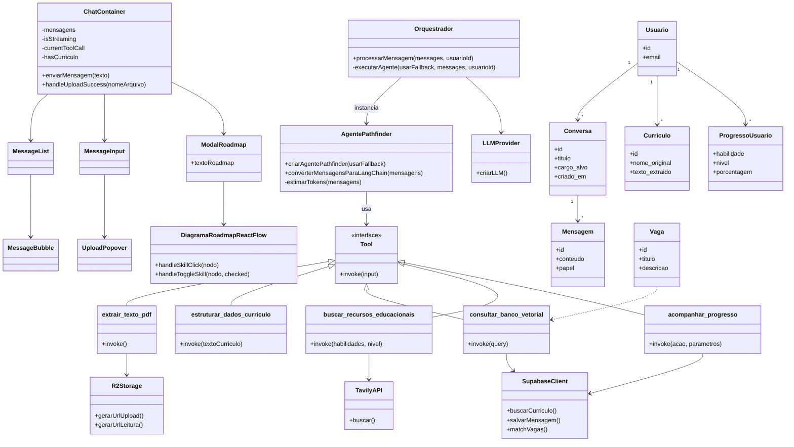
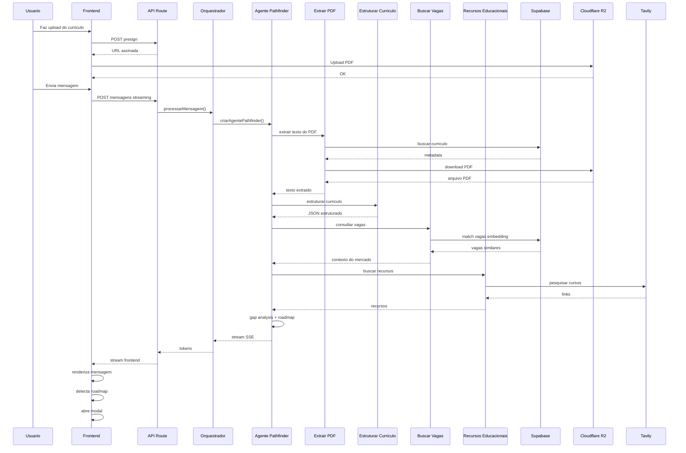
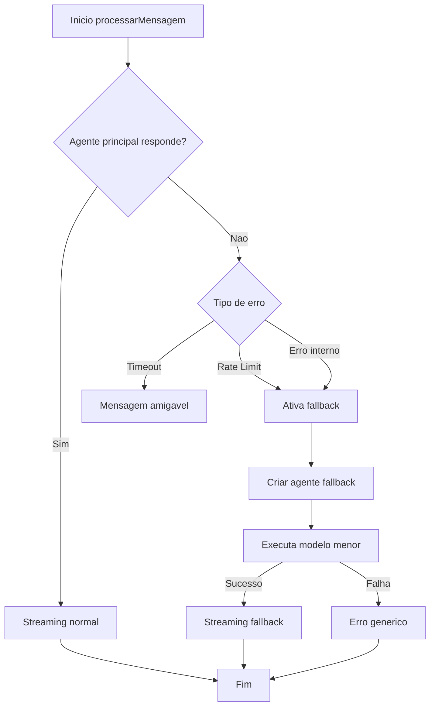

# Diagramas da Arquitetura

Este documento contém representações visuais da estrutura de classes e fluxos do **NextStepAI**, utilizando **Mermaid** para diagramas textuais.

## Diagrama de Classes (UML)

O diagrama abaixo representa os principais componentes do sistema, seus relacionamentos e responsabilidades.

O fluxo arquitetural segue uma abordagem inspirada em **Kanban**, dividida em estágios:

1. **Entrada** — Mensagem do usuário + currículo (se houver)  
2. **Análise** — Extração e estruturação do currículo  
3. **Pesquisa** — Busca semântica de vagas e recursos educacionais  
4. **Geração** — Gap analysis, roadmap, diagrama e PDF  
5. **Conclusão** — Persistência e acompanhamento de progresso  

## Fluxo Kanban Representado

| Coluna | Classes envolvidas | Responsabilidade |
|---|---|---|
| **Entrada** | `ChatContainer`, `MessageInput`, `UploadPopover` | Usuário envia mensagem e currículo |
| **Análise** | `Orquestrador`, `AgentePathfinder`, `extrair_texto_pdf`, `estruturar_dados_curriculo` | Processamento do currículo |
| **Pesquisa** | `consultar_banco_vetorial`, `buscar_recursos_educacionais` | Busca de vagas e materiais educacionais |
| **Geração** | `AgentePathfinder`, `DiagramaRoadmapReactFlow`, `ModalRoadmap` | Criação do roadmap e visualização |
| **Conclusão** | `acompanhar_progresso`, `SupabaseClient`, `Conversa`, `Mensagem`, `ProgressoUsuario` | Persistência dos dados |

---

## Fluxo Principal com Currículo (Sequência)

---

## Fluxo de Fallback (Timeout ou Falha)

---

## Convenção Visual dos Diagramas

| Cor lógica | Categoria |
|---|---|
| 🟩 Verde | Agente IA e Orquestrador |
| 🟦 Azul | Frontend React |
| 🟨 Amarelo | Banco de Dados |
| 🟪 Roxo | Integrações Externas |

> Os diagramas representam a arquitetura da versão **E3 (MVP Completo)** do sistema.  
> Atualizações futuras devem modificar diretamente os blocos Mermaid deste documento.