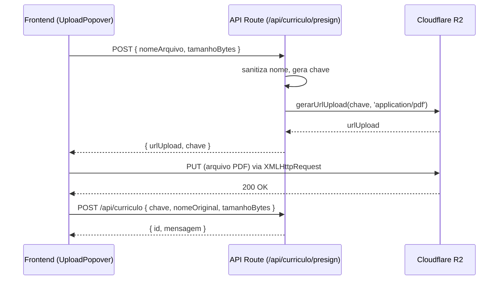

```markdown
# Armazenamento no Cloudflare R2

O NextStepAI utiliza o **Cloudflare R2** (armazenamento de objetos compatível com S3) para guardar os currículos enviados pelos usuários. O R2 foi escolhido por não cobrar por egress (download) e oferecer integração simples via SDK da AWS.

Este documento descreve a configuração do cliente R2, a geração de **presigned URLs** (upload e leitura), as operações de deleção e o fluxo de upload direto do frontend.

## 1. Configuração do Cliente R2

**Arquivo:** `src/lib/r2/cliente.ts`

```typescript
import { S3Client } from '@aws-sdk/client-s3';

if (!process.env.R2_ENDPOINT) {
  throw new Error('Variável de ambiente R2_ENDPOINT não definida');
}
if (!process.env.R2_ACCESS_KEY_ID) {
  throw new Error('Variável de ambiente R2_ACCESS_KEY_ID não definida');
}
if (!process.env.R2_SECRET_ACCESS_KEY) {
  throw new Error('Variável de ambiente R2_SECRET_ACCESS_KEY não definida');
}

export const r2Client = new S3Client({
  region: 'auto',
  endpoint: process.env.R2_ENDPOINT,
  credentials: {
    accessKeyId: process.env.R2_ACCESS_KEY_ID,
    secretAccessKey: process.env.R2_SECRET_ACCESS_KEY,
  },
});

export const BUCKET_NAME = process.env.R2_BUCKET_NAME || 'nextstepai-curriculos';
```

**Variáveis de ambiente obrigatórias:**

| Variável | Exemplo | Onde obter |
|----------|---------|-------------|
| `R2_ENDPOINT` | `https://<accountid>.r2.cloudflarestorage.com` | Cloudflare Dashboard → R2 → Overview |
| `R2_ACCESS_KEY_ID` | `abc123...` | Cloudflare R2 → Manage API Tokens → Create Token (permissões de leitura/escrita no bucket) |
| `R2_SECRET_ACCESS_KEY` | `xyz789...` | Mesmo token, campo Secret Key |
| `R2_BUCKET_NAME` | `nextstepai-curriculos` | Nome do bucket criado (padrão: `nextstepai-curriculos`) |

## 2. Operações com Presigned URLs

Todas as funções de geração de URLs assinadas estão em `src/lib/r2/operacoes.ts`.

### 2.1 Gerar URL de Upload

```typescript
import { PutObjectCommand } from '@aws-sdk/client-s3';
import { getSignedUrl } from '@aws-sdk/s3-request-presigner';
import { r2Client, BUCKET_NAME } from './cliente';

export async function gerarUrlUpload(chave: string, contentType: string): Promise<string> {
  const command = new PutObjectCommand({
    Bucket: BUCKET_NAME,
    Key: chave,
    ContentType: contentType,
  });
  return getSignedUrl(r2Client, command, { expiresIn: 3600 }); // 1 hora
}
```

**Uso:**  
- Chamada pela API route `POST /api/curriculo/presign`.  
- Retorna uma URL que o frontend pode usar para fazer `PUT` diretamente ao R2, sem expor as credenciais.

### 2.2 Gerar URL de Leitura

```typescript
import { GetObjectCommand } from '@aws-sdk/client-s3';

export async function gerarUrlLeitura(chave: string): Promise<string> {
  const command = new GetObjectCommand({
    Bucket: BUCKET_NAME,
    Key: chave,
  });
  return getSignedUrl(r2Client, command, { expiresIn: 3600 });
}
```

**Uso:**  
- Chamada internamente pela tool `extrair_texto_pdf` (no servidor) para baixar o PDF.  
- Também usada pela API `GET /api/curriculo` para fornecer ao frontend uma URL de visualização do PDF já enviado.

### 2.3 Deletar Objeto

```typescript
import { DeleteObjectCommand } from '@aws-sdk/client-s3';

export async function deletarObjeto(chave: string): Promise<void> {
  const command = new DeleteObjectCommand({
    Bucket: BUCKET_NAME,
    Key: chave,
  });
  await r2Client.send(command);
}
```

**Uso:**  
- Chamada pela API `DELETE /api/curriculo` quando o usuário remove seu currículo.

## 3. Fluxo de Upload Direto do Frontend

O upload é realizado em três etapas, sem passar o arquivo pelo servidor:



**Detalhes importantes:**

- O tamanho máximo do arquivo é **5 MB** (validado tanto no frontend quanto no backend).
- O nome do arquivo é sanitizado: acentos removidos, caracteres especiais substituídos por `_`.
- A chave no R2 segue o padrão: `curriculos/{usuarioId}/{timestamp}-{nomeSanitizado}`.
- O upload direto é feito com `XMLHttpRequest` para permitir monitoramento de progresso (evento `upload.onprogress`).

## 4. CORS no R2

Para que o frontend possa fazer upload direto, o bucket R2 deve ter configuração de CORS apropriada. No Cloudflare Dashboard:

1. Acesse o bucket → **Settings** → **CORS**.
2. Adicione a seguinte regra (substitua `http://localhost:3000` pela URL de produção):

```json
[
  {
    "AllowedOrigins": ["http://localhost:3000", "https://seu-dominio.vercel.app"],
    "AllowedMethods": ["PUT", "GET", "DELETE"],
    "AllowedHeaders": ["Content-Type"],
    "ExposeHeaders": ["ETag"],
    "MaxAgeSeconds": 3600
  }
]
```

## 5. Limpeza e Garbage Collection

- Quando o usuário remove o currículo (via `DELETE /api/curriculo`), o objeto no R2 é deletado **antes** do registro no banco.
- Não há garbage collection automática para currículos órfãos (ex.: usuário deleta conta). Em um ambiente de produção, pode-se implementar uma função periódica (Cloudflare Worker) que remova objetos sem registro correspondente no Supabase.

## 6. Tratamento de Erros

| Erro | Causa | Solução |
|------|-------|---------|
| `AccessDenied` | Credenciais R2 inválidas ou token sem permissão | Verificar `R2_ACCESS_KEY_ID` e `R2_SECRET_ACCESS_KEY` |
| `NoSuchBucket` | Bucket não existe | Criar o bucket manualmente no Cloudflare R2 |
| `Presigned URL expired` | URL expirou após 1 hora | Regerar nova URL via `/api/curriculo/presign` |
| `CORS policy` | Origem não permitida | Atualizar regras CORS do bucket |
| `File too large` (>5 MB) | Validação no backend | Frontend já bloqueia, mas reforçar no servidor |

## 7. Exemplo de Uso na Tool `extrair_texto_pdf`

A tool `extrair_texto_pdf` (no servidor) utiliza a URL de leitura para baixar o PDF:

```typescript
const urlLeitura = await gerarUrlLeitura(curriculo.chaveR2);
const response = await fetch(urlLeitura);
const pdfBuffer = await response.arrayBuffer();
// extração com `unpdf`...
```

Como a chamada é feita no servidor (API route), não há CORS envolvido. O timeout da fetch é de 30 segundos.

## 8. Segurança

- **As presigned URLs expiram em 1 hora** – mitigam o risco de acesso indevido a objetos.
- **As URLs de upload permitem apenas `PUT`** – não permitem listagem ou leitura de outros objetos.
- **As chaves de acesso ao R2 (`R2_ACCESS_KEY_ID`, `R2_SECRET_ACCESS_KEY`) nunca são expostas ao cliente** – ficam apenas no ambiente do servidor (Vercel ou `.env.local`).
- **O nome do objeto contém o `usuarioId`** – facilita a associação, mas não impede acesso via presigned URL (que já é restrito por tempo).

## 9. Monitoramento e Logs

- O Cloudflare R2 fornece métricas de uso (armazenamento, operações) no dashboard.
- No código, logs de erro são emitidos sempre que uma operação R2 falha (ex.: `console.error('[R2] erro ao gerar URL:', error)`).
- Para debug local, pode-se usar o script `npm run test:r2` que testa as credenciais e lista objetos.

---

**Próximo passo:** Consulte [schema.md](../banco-de-dados/schema.md) para o detalhamento das tabelas do banco.
```
